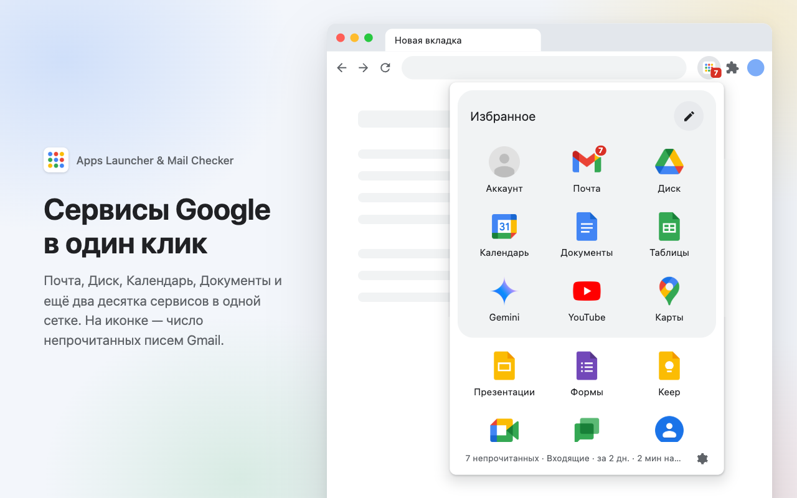
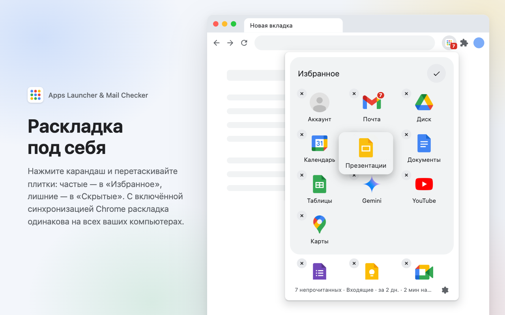
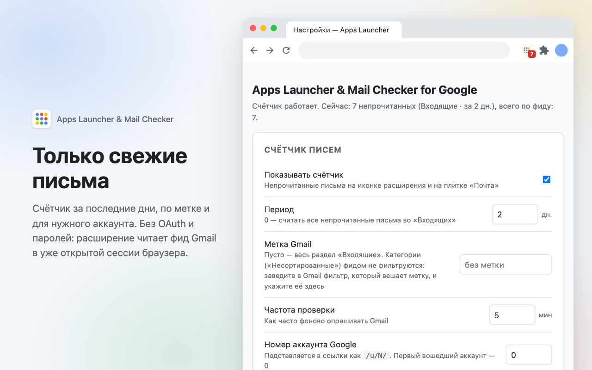

# Apps Launcher & Mail Checker for Google

**Сервисы Google в один клик и счётчик непрочитанных писем Gmail на панели браузера**

[][webstore]

[Возможности](#возможности) · [Установка](#установка) · [Как пользоваться](#как-пользоваться) · [Настройки](#настройки) · [Вопросы](#вопросы-и-ответы) · [Конфиденциальность](#конфиденциальность)

<picture>
  <source media="(prefers-color-scheme: dark)" srcset="store/images/screenshot-4-dark.png">
  
</picture>

## Возможности

<table>
  <tr>
    <td width="33%" valign="top">
      <b>Все сервисы под рукой</b> 
      Почта, Диск, Календарь, Документы, Gemini, YouTube, Карты и ещё два десятка
      сервисов в одной сетке. Одно нажатие — и сервис открыт в новой вкладке.
    </td>
    <td width="33%" valign="top">
      <b>Счётчик писем на иконке</b> 
      Число непрочитанных писем Gmail видно прямо на панели браузера и на плитке
      «Почта». Открывать почту, чтобы проверить, не нужно.
    </td>
    <td width="33%" valign="top">
      <b>Только свежие письма</b> 
      Считайте всё во «Входящих» или только письма за последние дни. Можно считать
      одну метку Gmail и выбрать нужный аккаунт.
    </td>
  </tr>
  <tr>
    <td valign="top">
      <b>Раскладка под себя</b> 
      Частые сервисы — в «Избранное», лишние — в «Скрытые». Всё перетаскиванием,
      прямо в окне расширения.
    </td>
    <td valign="top">
      <b>Без OAuth и паролей</b> 
      Достаточно войти в Gmail в этом браузере. Расширение не запрашивает OAuth-доступ
      к аккаунту Google и не знает ваш пароль.
    </td>
    <td valign="top">
      <b>Ничего лишнего</b> 
      Без аналитики, рекламы и сторонних серверов. Светлая и тёмная тема по настройкам
      системы, настройки синхронизируются через Chrome.
    </td>
  </tr>
</table>

  
  

<b>Все 26 сервисов</b>

 

| Основные | Для работы | Прочие | Облако и разработка |
| --- | --- | --- | --- |
| Аккаунт Почта Календарь Диск Документы Таблицы Презентации Формы Keep Gemini | Meet Chat Контакты Группы Задачи | YouTube Карты Фото Переводчик Новости Поиск Play | Cloud Console Colab AI Studio Analytics |

## Установка

1. Откройте [страницу расширения в Chrome Web Store][webstore] и нажмите **Установить**.
2. Закрепите иконку на панели: значок пазла справа от адресной строки → булавка рядом
   с **Apps Launcher & Mail Checker for Google**.
3. Войдите в Gmail в этом браузере, если ещё не вошли.

Готово: счётчик появится на иконке в течение минуты. Ключи, проекты в Google Cloud и
экраны согласия не нужны, обновления приходят автоматически.

<b>Установка вручную из архива</b>

 

Подходит, если магазин недоступен. Кроме браузера ничего не нужно.

1. Скачайте `extension.zip` из
   [последнего релиза](https://github.com/CoolyWooly/mail_checker/releases/latest).
2. Распакуйте архив в постоянную папку — например, `~/Applications/mail-checker`.
   **Не оставляйте её в «Загрузках»:** Chrome читает файлы расширения с диска при каждом
   запуске, и если папку удалить или переместить, расширение перестанет работать.
3. Откройте `chrome://extensions`.
4. Включите **Режим разработчика** — тумблер в правом верхнем углу.
5. Нажмите **Загрузить распакованное расширение** и выберите распакованную папку.

Что стоит знать про такую установку:

- При запуске Chrome может показывать плашку «Отключите расширения, работающие в режиме
  разработчика». Её можно закрыть, расширение продолжит работать.
- Обновления не приходят сами. Чтобы обновиться, распакуйте новый архив **поверх**
  старой папки и нажмите «Обновить» (круговая стрелка) на карточке расширения в
  `chrome://extensions`. Настройки при этом сохраняются.
- Версия из архива и версия из магазина — два разных расширения, у каждого свои
  настройки. Если переходите на версию из магазина, удалите копию из архива, иначе на
  панели будет две иконки.

## Как пользоваться

- **Открыть сервис** — нажмите на иконку расширения, затем на плитку.
  С <kbd>Ctrl</kbd> (<kbd>⌘</kbd> на Mac) сервис откроется в фоновой вкладке, а окно
  расширения останется открытым — удобно, чтобы открыть сразу несколько.
- **Изменить раскладку** — нажмите карандаш в карточке «Избранное». Плитки можно
  перетаскивать куда угодно: внутри «Избранного», в него из нижнего списка и обратно.
  Крестик в углу плитки убирает её в «Скрытые», плюс возвращает на место. Галочка
  завершает правку, порядок сохраняется сразу.
- **Открыть настройки** — шестерёнка внизу окна расширения или правый клик по иконке →
  **Параметры**.

Что показывает бейдж на иконке:

| Бейдж | Значение |
| --- | --- |
| число | столько непрочитанных писем за выбранный период |
| `20+` | за период больше 20 непрочитанных, см. [вопросы](#вопросы-и-ответы) |
| пусто | непрочитанных нет или счётчик выключен |
| `?` | нет сессии Gmail — войдите в Gmail в этом браузере |
| оранжевый фон | последнее обновление не удалось, показано прошлое число |

## Настройки

| Параметр | По умолчанию | Описание |
| --- | --- | --- |
| Показывать счётчик | вкл | Выключите, если нужен только лаунчер: бейдж и фоновые запросы пропадут |
| Период | 2 дня | `0` — все непрочитанные во «Входящих», `1`–`30` — только письма за N дней |
| Метка Gmail | пусто | Считать письма только с этой меткой. Пусто — весь раздел «Входящие» |
| Частота проверки | 5 минут | От 1 до 240 минут |
| Номер аккаунта | 0 | Какой из аккаунтов Google считать и открывать, если вы вошли в несколько |
| Плитки | все видимы | Ненужные сервисы можно скрыть чекбоксами |

Порядок плиток задаётся перетаскиванием в окне расширения. Если в Chrome включена
синхронизация, настройки и раскладка переедут на все ваши компьютеры.

## Как это работает

Расширение читает служебный Atom-фид Gmail в сессии, уже открытой в браузере. Из фида
берутся только общее число непрочитанных писем и даты последних писем. Темы, отправители
и текст писем не извлекаются.

Фид содержит не больше 20 последних писем, поэтому возможны два режима:

| Период | Что показывает бейдж |
| --- | --- |
| `0` | точное общее число непрочитанных во «Входящих» |
| `1`–`30` | письма за N дней; если непрочитанных больше 20, показывается `20+` |

## Конфиденциальность

- Содержимое писем не используется и никуда не отправляется: из фида берутся только
  число непрочитанных и даты.
- Никакой аналитики, рекламы, трекеров и собственных серверов.
- Настройки хранятся в Chrome, у разработчика доступа к ним нет.
- Исходный код открыт — всё, что делает расширение, можно проверить в этом репозитории.

| Разрешение | Зачем |
| --- | --- |
| `storage` | хранить настройки и последнее известное число писем |
| `alarms` | проверять почту по таймеру в фоне |
| `https://mail.google.com/*` | читать фид Gmail с числом непрочитанных |

Подробно — в [политике конфиденциальности](PRIVACY.md).

## Вопросы и ответы

<b>На иконке знак вопроса</b>

 

Расширение не нашло открытую сессию Gmail. Войдите в Gmail в этом браузере — или
нажмите на строку статуса внизу окна расширения, она откроет страницу входа. Если вы
вошли в несколько аккаунтов, проверьте поле **Номер аккаунта** в настройках.

<b>Почему бейдж показывает «20+», а не точное число</b>

 

Фид Gmail отдаёт только 20 последних писем, поэтому посчитать письма за период точнее
нельзя. Если нужно точное общее число, поставьте в настройках период `0`: тогда бейдж
покажет все непрочитанные во «Входящих».

<b>Как считать только «Несортированные» без промоакций и соцсетей</b>

 

Фид не умеет фильтровать по категориям Gmail — это доступно только через Gmail API с
OAuth, от которого расширение сознательно отказалось. Но есть обходной путь через метку:

1. В Gmail откройте *Настройки → Фильтры и заблокированные адреса → Создать фильтр*.
2. В поле «Содержит слова» укажите `category:primary`.
3. Выберите действие «Применить ярлык», например `Primary`.
4. Имя этого ярлыка впишите в поле **Метка Gmail** в настройках расширения.

Фильтр применяется к новым письмам, поэтому старые придётся разметить вручную через
поиск.

<b>Как выбрать другой аккаунт Google</b>

 

Откройте Gmail нужного аккаунта и посмотрите на адрес: в `mail.google.com/mail/u/1/`
номер аккаунта — `1`. Укажите его в поле **Номер аккаунта** в настройках. Счётчик
переключится на этот аккаунт, а плитки будут открывать сервисы от его имени.

<b>Бейдж стал оранжевым</b>

 

Последняя проверка не удалась — например, пропал интернет или Gmail не ответил. На
иконке остаётся прошлое число, а расширение попробует снова при следующей проверке.
Чтобы не ждать, нажмите «повторить» внизу окна расширения. Текст ошибки показан на
странице настроек.

## Обратная связь

Нашли ошибку или не хватает нужного сервиса? [Создайте issue](https://github.com/CoolyWooly/mail_checker/issues)
— это лучший способ сообщить. Если расширение пригодилось, поставьте ⭐ репозиторию и
оставьте отзыв в [Chrome Web Store][webstore].

Хотите поправить код или собрать расширение сами — всё про сборку, тесты и выпуск версий
в [руководстве для разработчиков](docs/development.md).

---

Расширение не связано с Google LLC и не одобрено ею. Google, Gmail, а также
названия и логотипы сервисов — товарные знаки Google LLC.

<!-- После публикации в Chrome Web Store замените ссылку ниже на страницу расширения:
     https://chromewebstore.google.com/detail/<ID> -->
[webstore]: https://github.com/CoolyWooly/mail_checker/releases/latest
