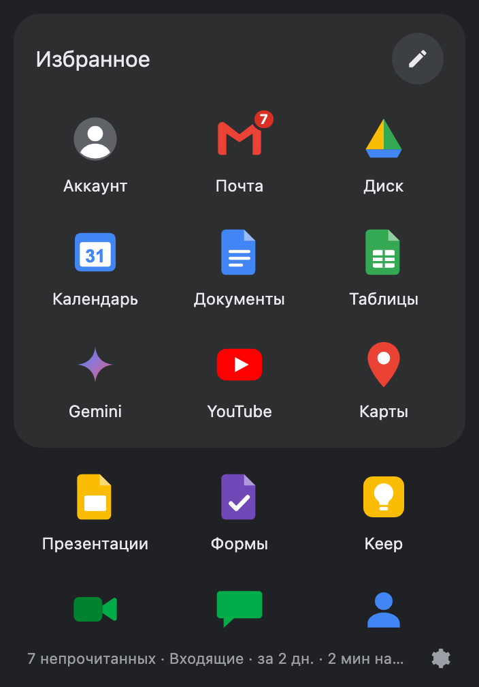
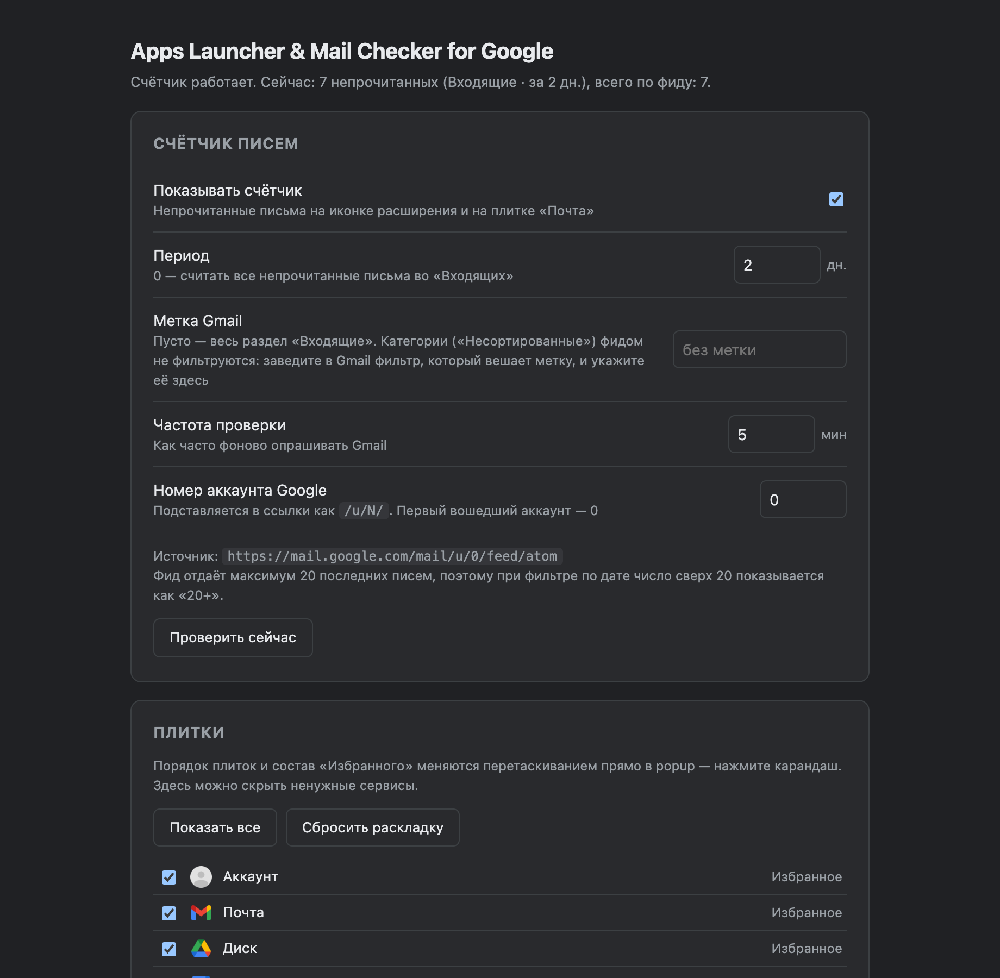

# Apps Launcher & Mail Checker for Google

Расширение Chrome (Manifest V3): лаунчер сервисов Google в стиле «сетки приложений»
и счётчик непрочитанных писем Gmail на иконке расширения.

- Popup: карточка «Избранное» и остальные сервисы ниже, 26 плиток.
- Порядок плиток, состав «Избранного» и скрытие ненужных — прямо в popup по карандашу.
- Бейдж с числом непрочитанных на иконке расширения и на плитке «Почта».
- Авторизация не нужна: число берётся из Atom-фида Gmail по сессии браузера.

## Как выглядит



Popup: карточка «Избранное» сверху, остальные сервисы ниже, счётчик и статус проверки
в подвале. Карандаш справа включает перетаскивание плиток.



Настройки: период подсчёта, метка Gmail, частота опроса, номер аккаунта и список плиток.

## Установка

Расширения нет в Chrome Web Store, оно ставится вручную из архива. Занимает минуту,
кроме браузера ничего не нужно.

1. Скачайте `extension.zip` из
   [последнего релиза](https://github.com/CoolyWooly/mail_checker/releases/latest).
2. Распакуйте архив в постоянную папку — например, `~/Applications/mail-checker`.
   **Не оставляйте её в «Загрузках»:** Chrome читает файлы расширения с диска при каждом
   запуске, и если папку удалить или переместить, расширение перестанет работать.
3. Откройте `chrome://extensions`.
4. Включите **Режим разработчика** — тумблер в правом верхнем углу.
5. Нажмите **Загрузить распакованное расширение** и выберите распакованную папку.

Готово. Если вы уже вошли в Gmail в этом браузере, счётчик появится в течение минуты.
Никаких ключей, проектов в Google Cloud и экранов согласия.

Что стоит знать про такую установку:

- При запуске Chrome показывает плашку «Отключите расширения, работающие в режиме
  разработчика». Её можно закрыть, расширение продолжит работать.
- Обновления не приходят сами — см. раздел ниже.
- ID расширения зафиксирован полем `key` в `manifest.json`, поэтому настройки переживают
  перемещение папки и переустановку.

### Обновление

1. Скачайте новый `extension.zip` из релизов.
2. Распакуйте **поверх** старой папки, заменив файлы.
3. На `chrome://extensions` нажмите «Обновить» (круговая стрелка) на карточке расширения.

Настройки лежат в профиле браузера и при обновлении не теряются.

### Установка из исходников

Для разработки архив не нужен: склонируйте репозиторий и на шаге 5 выберите корень проекта.

```bash
git clone https://github.com/CoolyWooly/mail_checker.git
```

## Как работает счётчик

Расширение читает `https://mail.google.com/mail/u/0/feed/atom` — это встроенный фид
Gmail, который отдаётся на куках уже открытой сессии. Из него берутся:

- `<fullcount>` — точное общее число непрочитанных писем;
- до **20** последних писем с датами — по ним считается фильтр «за N дней».

Отсюда два режима:

| Период в настройках | Что показывает бейдж |
| --- | --- |
| `0` | точное общее число непрочитанных во «Входящих» |
| `1`–`30` | письма за N дней; если непрочитанных больше 20, показывается «20+» |

Прочие значения бейджа:

| Бейдж | Значение |
| --- | --- |
| пусто | непрочитанных нет или счётчик выключен |
| `?` | нет сессии Gmail — войдите в Gmail в этом браузере |
| оранжевый фон | последнее обновление не удалось, показано прошлое число |

Запрос к фиду прерывается по таймауту в 15 с, неудачный опрос повторяется дважды
(через 1 с и 3 с) и только потом попадает в статус ошибкой.

### Категории Gmail

Фильтр по категории («Несортированные», «Промоакции» и т.д.) через Atom-фид
**невозможен** — фид отдаёт только «Входящие» целиком или отдельную метку. Это плата за
отказ от OAuth: категории доступны лишь через Gmail API с авторизацией.

Обходной путь, если категория важна: в Gmail создайте фильтр
(*Настройки → Фильтры → Создать*) с условием `category:primary`, действие — «Применить
ярлык», например `Primary`. Имя этого ярлыка укажите в поле **Метка Gmail** в настройках
расширения, и счётчик станет считать только его. Фильтр применяется к новым письмам,
поэтому старые придётся разметить вручную через поиск.

## Настройки

Карандаш в popup — перетаскивание плиток. Шестерёнка внизу — страница настроек.

| Параметр | По умолчанию | Описание |
| --- | --- | --- |
| Показывать счётчик | вкл | Выключение убирает бейдж и фоновые запросы |
| Период | 2 дня | 0 — все непрочитанные, 1–30 — окно по дате |
| Метка Gmail | пусто | Пусто — весь раздел «Входящие» |
| Частота проверки | 5 минут | Минимум 1 минута (ограничение `chrome.alarms`) |
| Номер аккаунта | 0 | Подставляется в ссылки как `/u/N/` |
| Плитки | все видимы | Ненужные сервисы можно скрыть |

Порядок плиток задаётся только перетаскиванием в popup; на странице настроек показано,
в какой зоне («Избранное» или «Ещё») сейчас каждый сервис.

## Режим правки

Нажмите карандаш в шапке карточки — popup переходит в режим правки. В нём клики по
плиткам не открывают вкладки.

- **Порядок**: тащите плитку куда угодно — внутри «Избранного», внутрь него из нижнего
  списка и обратно. Порядок сохраняется сразу на отпускании.
- **Скрыть**: кнопка **×** в углу плитки убирает её в раздел «Скрытые» внизу popup.
- **Вернуть**: кнопка **+** на скрытой плитке возвращает её на прежнее место.
- Галочка выходит из режима правки; раздел «Скрытые» виден только внутри него.

Скрытые плитки можно также включать и выключать чекбоксами на странице настроек.

Перетаскивание сделано на pointer-событиях: цель определяется по заранее замеренным
координатам плиток, поэтому срабатывает и попадание в зазор между иконками, а список
автоматически прокручивается у краёв. Позиция плавающей копии обновляется раз в кадр
через `translate`, DOM переставляется только когда цель действительно сменилась — иначе
каждое движение мыши упиралось бы в пересчёт раскладки.

## Разрешения

| Разрешение | Зачем |
| --- | --- |
| `storage` | настройки и последнее известное число писем |
| `alarms` | фоновый опрос по таймеру |
| `https://mail.google.com/*` | чтение Atom-фида |

Письма не читаются и никуда не отправляются: из фида берутся только счётчик и даты.

## Структура

```
manifest.json
package.json     только скрипты и "type": "module"; зависимостей нет
src/
  background.js   service worker: таймер, опрос фида, бейдж
  gmail.js        чтение и разбор Atom-фида
  settings.js     схема настроек и chrome.storage.sync
  services.js     каталог 26 сервисов
  popup.*         лаунчер и перетаскивание
  options.*       страница настроек
icons/            иконка расширения (PNG) и 26 SVG сервисов
scripts/          генераторы иконок и dev-превью
test/             node --test по чистым функциям
dev/              страницы с заглушкой Chrome API для правки верстки (генерируются)
```

В расширение попадают только `manifest.json`, `src/` и `icons/` — остальное нужно
разработке. Зависимостей нет, `npm install` не требуется.

## Разработка

```bash
npm test              # node --test: normalize, feedUrl, entryDates, fetchUnread, badgeText
npm run build:icons   # icons/icon*.png — иконка самого расширения
npm run fetch:icons   # icons/services/*.png — официальные логотипы сервисов
npm run build:previews # dev/preview-*.html — после правки src/*.html
```

Иконка расширения и превью собираются из кода, без внешних зависимостей.

Логотипы сервисов в `icons/services/` — официальные, скачаны с `gstatic.com`
(у Colab и AI Studio своих записей там нет, взяты их фавиконки). Источники
закреплены в `scripts/fetch-service-icons.mjs`; скрипт нужен только при
добавлении сервиса или смене логотипа — сами файлы лежат в репозитории,
расширение в сеть за ними не ходит. Логотипы принадлежат Google и остаются
её товарными знаками: здесь они используются для обозначения самих сервисов.

## Выпуск релиза

```bash
npm run pack   # dist/extension.zip из manifest.json, src/ и icons/
gh release create v1.0.0 dist/extension.zip --title v1.0.0 --notes "Что изменилось"
```

Версию поднимайте одновременно в `manifest.json`, `package.json` и теге релиза — Chrome
считает версию из манифеста и без её роста не покажет обновление как обновление.

Поле `key` в `manifest.json` — публичная часть ключа из `key.pem`. Она задаёт постоянный
ID расширения `mifkjbgmkmlnbamlnjfkgigopmjmdihh`, одинаковый у всех установок. `key.pem`
лежит только локально и в репозиторий не попадает. В Chrome Web Store ID назначает сам
магазин, поэтому архив для него собирается отдельно и уже без `key` (см. ниже).

## Публикация в Chrome Web Store

```bash
npm run pack:store          # dist/extension-store.zip: тот же архив, но без поля key в манифесте
npm run build:store-assets  # store/images/: скриншоты 1280×800 и промо-баннер 440×280
```

Что вставлять в каждую вкладку дашборда (описание, обоснования разрешений, ответы про
данные), расписано в [store/listing.md](store/listing.md). Политика конфиденциальности
лежит в [PRIVACY.md](PRIVACY.md).

Картинки рендерятся из `store/templates/*.html` в headless Chrome. Шаблоны встраивают
превью из `dev/`, так что на скриншотах настоящий popup и настоящая страница настроек,
а не копия верстки. Если Chrome установлен не в стандартное место, укажите путь в
`CHROME_PATH`. Шаблон можно открыть и в обычном браузере через тот же HTTP-сервер, что
и превью: `http://localhost:8765/store/templates/screenshot-1-popup.html`.

## Локальный просмотр верстки

`dev/preview-popup.html` и `dev/preview-options.html` — это `src/*.html` с подменёнными
путями и заглушкой Chrome API, чтобы править верстку без перезагрузки расширения.
**Они генерируются, править их руками не нужно:** измените `src/*.html` и запустите
`npm run build:previews`.

Нужен HTTP-сервер (ES-модули не грузятся с `file://`):

```bash
python3 -m http.server 8765
```

Затем откройте `http://localhost:8765/dev/preview-popup.html` — состояния счётчика
переключаются хешем: `#signed_out`, `#error`, `#nobg` (service worker не отвечает).
На работу расширения папка `dev/` не влияет.
